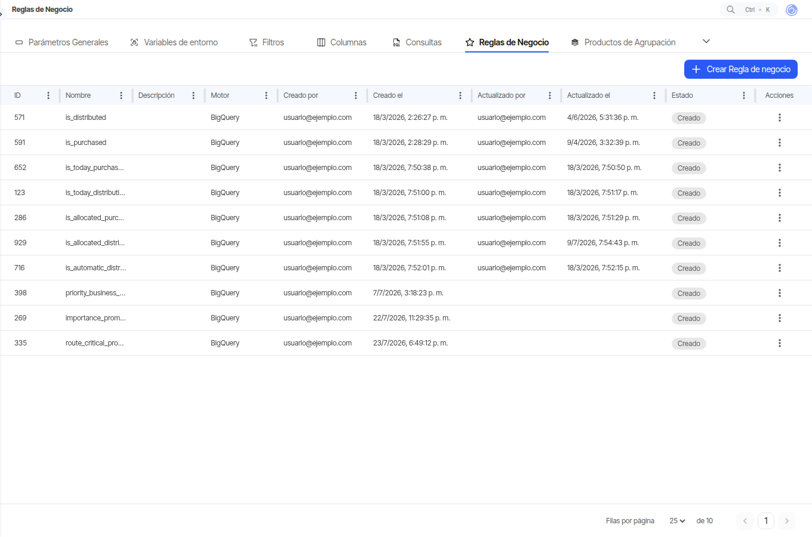

# Reglas de Negocio

## Qué es y para qué sirve { #que-es }

Hay preguntas sobre el catálogo que el dato del cliente no trae respondidas: *¿este producto se
compra?*, *¿este se distribuye?*, *¿con qué prioridad?*. Una regla de negocio es esa respuesta
escrita una sola vez y aplicada a todo el catálogo, en lugar de corregirla producto a producto
cada día.

Las reglas se trabajan agrupadas en **conjuntos de reglas**. Cada conjunto tiene su nombre, su
descripción y un **estado**, y el estado es lo que permite escribir una regla, revisarla, y solo
entonces dejarla actuar.

## Qué puedes hacer aquí { #que-puedes-hacer }

**Ver los conjuntos configurados.** La tabla lista cada conjunto con su **ID**, **Nombre**,
**Descripción**, **Motor**, quién lo creó y quién lo actualizó por última vez, y su **Estado**,
que se muestra como una etiqueta de color:

| Estado | Qué significa |
|---|---|
| **Creado** | El conjunto existe y todavía no se revisó. Es el estado en que nace |
| **Aprobado** | Revisado y en uso |
| **Rechazado** | Revisado y descartado |

**Crear un conjunto.** El botón **Crear Regla de Negocio** abre la pantalla de armado. Al guardar,
la aplicación pide el **Nombre** y la **Descripción** del conjunto, y queda abierto su detalle.

**Abrir el detalle.** *Ver detalles*, en el menú de la fila. Ahí está lo que la tabla no muestra:
las reglas del conjunto y el guion que las implementa.

**Renombrar.** *Editar* abre un diálogo con el **Nombre** y la **Descripción**. Esa acción no toca
las reglas: para eso está el detalle.

**Eliminar.** *Eliminar* pide confirmación y borra el conjunto entero, con sus reglas.

### Dentro del conjunto { #dentro-del-conjunto }

El detalle tiene tres campos arriba, la lista de reglas debajo y el guion a la derecha.

- **Motor** — con qué se evalúan las reglas. Es una decisión de implementación, no de operación:
  fija el lenguaje en que se expresa el guion y, con él, si el conjunto usa cláusula.
- **Cláusula** — qué papel juega el conjunto dentro del cálculo. Solo aparece con los motores que
  la admiten.
- **Estado** — el mismo de la tabla. Aquí es donde un conjunto se aprueba o se rechaza.
- **Reglas** — las condiciones del conjunto. Se añaden con **Agregar Regla**, se editan pulsando
  sobre una, y se **reordenan arrastrándolas**: el orden es parte de la definición, no una
  preferencia de visualización.
- **El guion**, en el panel de la derecha, con un botón para copiarlo. Es la forma ejecutable de
  las reglas, y quien lo escribe y lo mantiene es implementación.

**Guardar** aplica el conjunto completo; si no cambió nada, la aplicación lo dice en vez de
guardar. Los botones de esta pantalla exigen permiso de edición: sin él se ve todo y no se puede
tocar nada.

!!! warning "Una regla no tiene alcance parcial"

    Un conjunto aplica a todo lo que cumpla su condición, en toda la empresa. No existe
    «probémoslo en una tienda»: si la condición está mal acotada, el efecto es general. Antes de
    aprobar, la pregunta útil es **cuántos productos cambian de clasificación**, no cuáles.

!!! warning "«Creado» no se puede volver a elegir"

    El desplegable de **Estado** solo ofrece *Aprobado* y *Rechazado*. Un conjunto nace en
    *Creado* y, una vez movido, no vuelve a ese estado desde la pantalla: la marcha atrás es
    rechazarlo, no devolverlo a borrador.

!!! warning "Excluir de comprar no es excluir de distribuir"

    Son clasificaciones distintas y se resuelven por separado. Un producto puede quedar fuera de
    la compra y seguir apareciendo en la distribución, y al revés. Si el objetivo es sacarlo de la
    operación, hay que decirlo en las dos.

## Qué necesita para funcionar { #requisitos }

- **El permiso `activation.business-rules`** —o el anterior
  `administration.configuration.business-rules`, que abre la misma pantalla en su dirección
  anterior— y el de edición sobre él para crear, cambiar de estado o eliminar.
- **Los maestros de producto cargados**: un conjunto clasifica el catálogo, así que solo puede
  hablar de atributos que existan en él. Ver [Datos Maestros](../administracion/datos-maestros.md).
- **Acompañamiento de implementación** para el guion. Qué clasificar y con qué criterio es una
  decisión del cliente; su forma ejecutable no se escribe a ciegas.

Un cambio aquí **no recalcula nada en el momento**: se aplica en la siguiente corrida diaria.

## Conceptos relacionados { #conceptos }

- [Reglas de negocio y plugins](../conceptos/reglas-de-negocio-y-plugins.md) — los tres sitios
  donde se interviene el cálculo y en qué se distinguen.
- [El ciclo diario de datos](../conceptos/ciclo-diario-de-datos.md) — cuándo se nota lo que
  cambiaste hoy.
- [Por qué tu instancia puede diferir](../conceptos/por-que-tu-instancia-difiere.md) — no hay dos
  catálogos clasificados igual.
